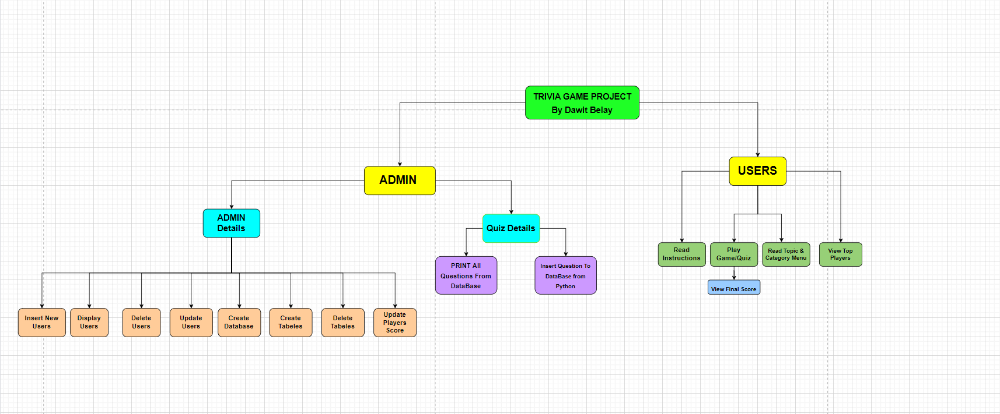
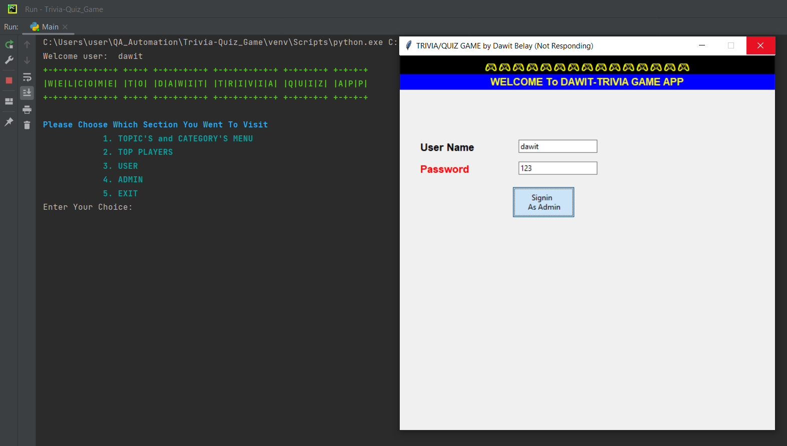
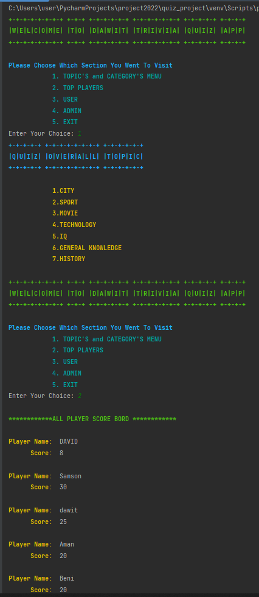
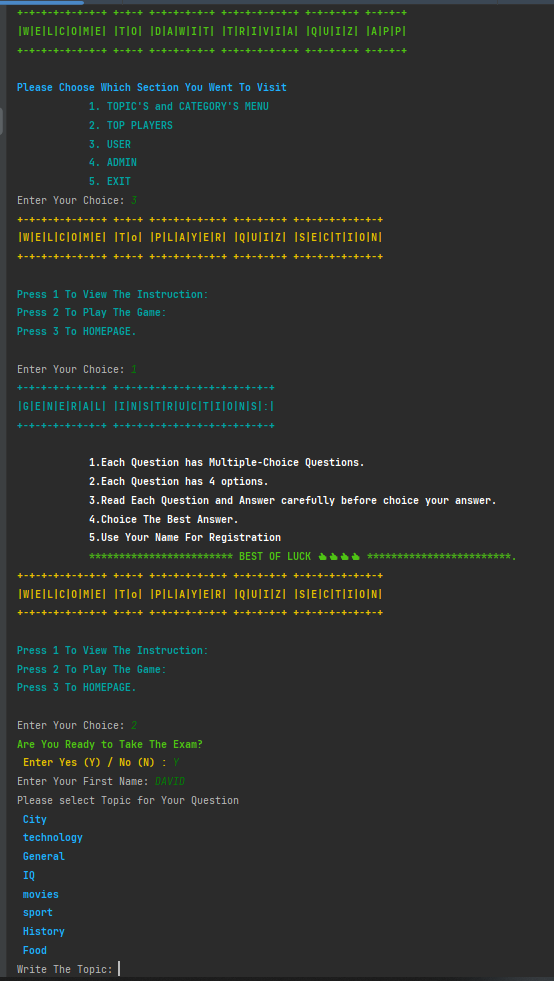
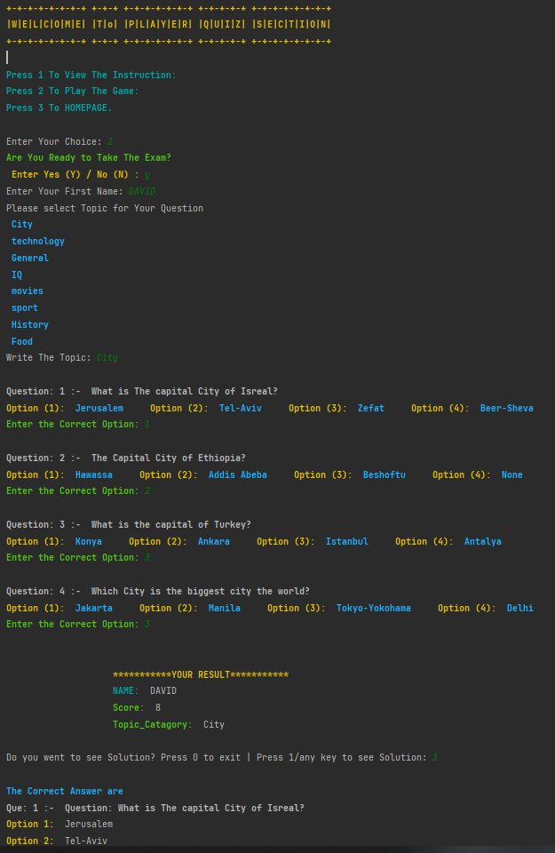
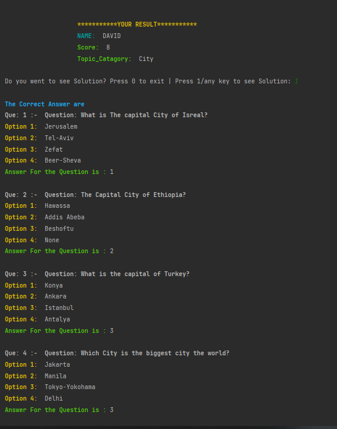
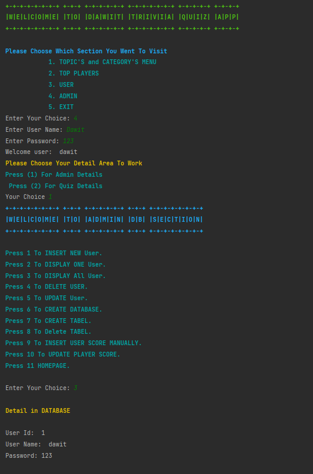
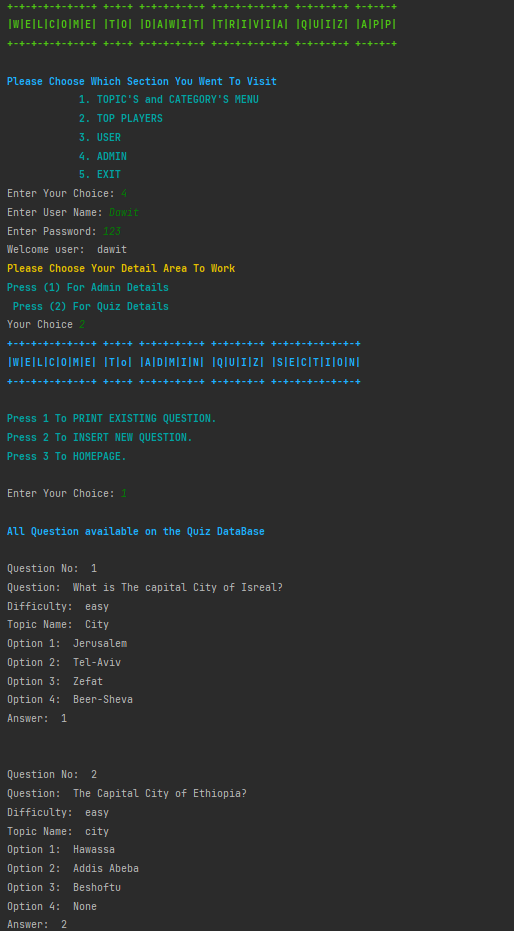
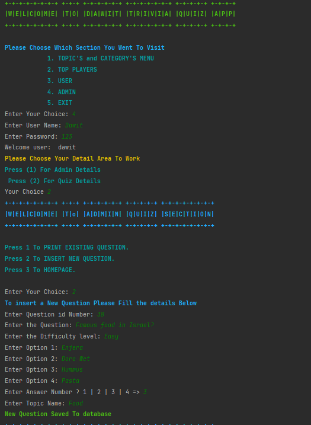

# ***.............................Trivia-Quiz-Game.......................***
    
## 👨‍💻Author 
- VERSION: 1.0.0
- Dawit Samson Belay
- [Link To GitHub/Dawit Samson](https://github.com/DawitSamson)

## **⚡ Trivia Question Game bullied in python and connected to Database **

# Overview
* The Project is Trivia Question Game, It bullied in python and connected to MYSQL database Server
* Trivia Game is a fun game in which players have to guess the answers of questions by filling the answers boxes with correct letters or choose.

### 🔑 Keywords:
>* mysql.connector = provide connectivity to the MySQL server for client programs.
>* pyfiglet = enhance the overall look and structure of the texts used in electronic communication way.
>* DesignColors = The color Library which I used
>* DataBase = Where the collection of data stored
>* Commit = used to make sure the changes made to the database
>* Execute = to execute Python MySQL queries on your MySQL database. 
>* queries = is a question or a request for information expressed in a formal manner. 
>* DML = Data Manipulation Language refers to DELETE, INSERT, REPLACE, SELECT, and UPDATE
>* MYDB = it refers to the database connection which I used
>* tkinter = it is Python's de-facto standard GUI (Graphical User Interface) package.

## 🚧 About The project
>* This project is Build in Python using OOP and have Multiple class.
>* The datas are generated from the Database and displayed in Python program
>* The main python file is the Motor or the Execute/Run the Program file.
>* To make the Coloring and decoration purpose I made a python file called "DesignColors". This file we will use it where ever we went a color. 
>* I also create "SMS python file" to make all the text which will be displayed/printed so that the code will be net.
>* When we came to the Database I created a python file which has the connection of the Python to Mysql DataBase.
>* The DB python file Consist of "DELETE, INSERT, REPLACE, SELECT, and UPDATE" all this will be Done using Python programming and connected to DB.
>* This Project also Consists of GUI(Graphical User Interface) using tkinter Package which is only Display the homepage which will Check Whether the User Is admin from the DataBase and start the Python Program. 
>* The GUI is not the finally "On progress" it will be updated 
>>* when the program start it will ask the User admin to enter the Adminer Name which is found on the DB, and it will check the admin Name and continue Working the code using Console.
>* This project consist of 6 Class (5=Found in DB Python file and 1 class= DesignColors)

### **🖨️ How does This Trivia Question Game Works **
* First this question will have Admin User and Normal User.
* The admin users can access all the Database and the Users. 
* The admin can Create,Insert,Delete and Upgrade Users,players,Questions generality Admin will control this App.
* The Normal users only access for View instructions and start taking the quiz.
* Each Question has Multiple-Choice Questions.
* Each Question has 4 options.
* The User need to Read Each Question and Answer carefully before choice your answer.
* The Users need to Use There Name For Registration
* Once the User finish it will show to the user the Score in each Question

## 📈 Diagram 
* The General Flow Chart Diagram for the Overall Project

## 📸 Screenshot 

## ⚙ Usage
* Open Pycharm
* Open Mysql workbench
* Open the Pycharm .py File on Pycharm Community Edition 
* Run the pycharm .py file

# 🛠️ Project Tools and Packages Used
>On this Project I used
>- Python Loops 
>- Python Functions
>- Python Arrays
>- Python Conditions
>- Object-oriented programming (OOP)
>- Python Package (emoji, colorama)
>- PyCharm
>- pyfiglet
>- Tkinter
>- Mysql DataBase
>- Mysql.Connector-Python

# 💻 Source
- Pycharm software
- GitHub 
- Google
- Mysql DataBase 
- Mysql Workbench
- w3schools

### 🙌☺️️☺️🙌  Thank you!!!    🙌☺️️☺️🙌
